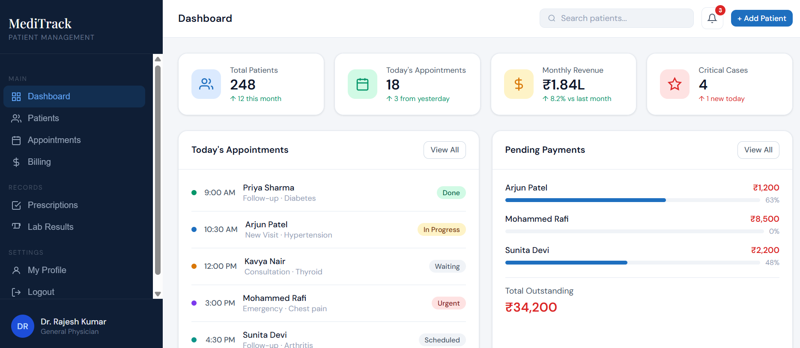

# 🏥 MediTrack — Enterprise-Grade Patient Record Management System

> A production-style healthcare management application that digitizes patient records, appointments, billing, prescriptions, and laboratory workflows in a modern, responsive web interface.

## 📸 Application Preview

## 🚀 Project Overview

MediTrack is a real-world Electronic Medical Record (EMR) and clinic management system that demonstrates how hospitals and healthcare startups manage patient data and operational workflows.

Built entirely with HTML, CSS, and JavaScript, the application showcases front-end engineering skills, responsive UI design, and CRUD-based data management using the browser's Local Storage API.

## 🎯 Business Problem Solved

Healthcare providers often struggle with:

- Manual paper-based patient records
- Missed appointments
- Fragmented billing systems
- Prescription tracking challenges
- Delayed laboratory result management
- Lack of centralized patient history

MediTrack solves these problems by consolidating all major healthcare operations into a single digital platform.

## ✨ Core Features

### 🔐 Secure Authentication
- Doctor login system with demo credentials
- Session-based access control

### 📊 Executive Dashboard
- Total patients
- Today's appointments
- Monthly revenue
- Critical cases
- Outstanding payments

### 👥 Patient Management
- Add, edit, delete, and search patient records
- Medical history and allergies
- Emergency contact information
- Insurance details

### 📅 Appointment Scheduling
- Schedule consultations
- Track appointment status
- Manage visit types and durations

### 💳 Billing & Revenue Management
- Generate invoices
- Track payments and outstanding balances
- Revenue analytics

### 💊 Prescription Module
- Record medications and treatment durations

### 🧪 Laboratory Results
- Store diagnostic reports and statuses

### 👨‍⚕️ Doctor Profile Management
- Professional details
- Working hours
- Password management

### 🔔 Smart Notifications
- Appointment reminders
- Lab alerts
- Payment updates

### 📱 Fully Responsive Design
- Desktop, tablet, and mobile compatibility

### 💾 Browser Data Persistence
- Uses Local Storage API to simulate a lightweight database

## 🛠️ Technology Stack

| Technology | Purpose |
|----------|---------|
| HTML5 | Application Structure |
| CSS3 | UI Styling and Responsive Design |
| JavaScript (ES6) | Business Logic and CRUD Operations |
| Local Storage API | Client-Side Data Persistence |
| SVG Icons | Lightweight Visual Assets |
| Google Fonts | Professional Typography |

## 🔑 Demo Credentials

| Field | Value |
|------|------|
| Email | `doctor@meditrack.com` |
| Password | `password123` |

